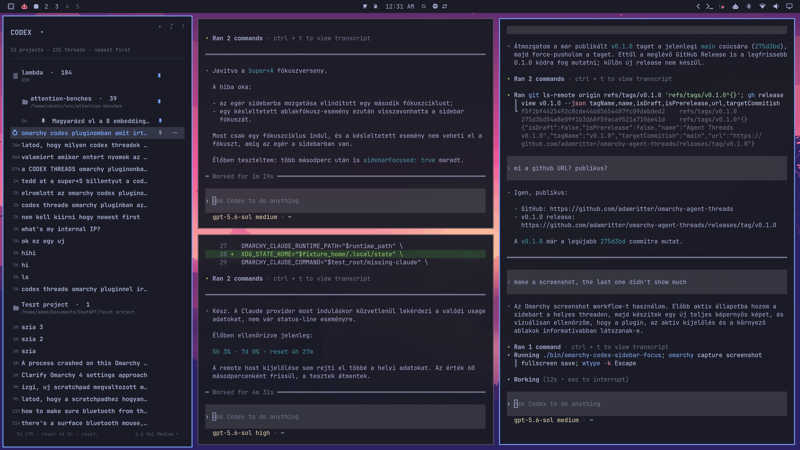

# Agent Threads for Omarchy

A keyboard-first Omarchy Shell sidebar for browsing, opening, organizing, and
monitoring local and remote coding-agent sessions.



## Highlights

- Browse Codex, Claude Code, and OpenCode sessions in one project-grouped list.
- Show Codex usage windows and Claude subscription `5h` / `7d` usage in the
  footer when the provider exposes them.
- Open an existing session or focus its already-running terminal window.
- Create a new thread from the current project, remote, or selected thread with
  the global `n` shortcut or a visible `+` button.
- See live session state and a distinct highlight for the active thread.
- Search threads and projects without leaving the keyboard.
- Pin threads, projects, and remotes; pinned items stay at the front.
- Collapse projects and remotes, with their state restored after a Shell
  restart.
- Keep large groups compact with a ten-thread preview and an explicit
  **Show all** row. Show-all expansion is intentionally reset on restart.
- Choose provider-specific model, reasoning effort, and agent values. Selections
  are remembered per provider.
- Pin, open, create beside, move between local Codex projects, or archive a
  thread from its overflow/right-click menu.
- Use direct thread, project, and remote pin buttons without opening a menu.
- Test, edit, or disable a configured remote from its small overflow/right-click
  menu.

## Providers

| Provider | Local sessions | Remote sessions | Selection support | Usage footer |
| --- | --- | --- | --- | --- |
| Codex | Yes | SSH or App Server | Model and reasoning effort | `5h` / `7d` windows |
| Claude Code | Yes | SSH | Model and reasoning effort when available | `5h` / `7d` when exposed |
| OpenCode | Yes | SSH | Model, variant, and agent | Not exposed by the OpenCode API |

Optional providers remain inactive until selected, so they do not continuously
poll or start their helper server in the background.

When OpenCode is selected, the plugin starts a localhost-only headless server
for session discovery and creates each new session before opening its TUI. This
makes window mapping immediate and reliable even before the first prompt. Model,
variant, and primary-agent choices are passed through OpenCode's native CLI
flags, while live status is read from the TUI's per-session server.

## Requirements

- A current Omarchy release with the Shell plugin system.
- Codex CLI available as `codex`.
- Node.js 22 or newer, `jq`, `inotifywait`, `hyprctl`, and standard procps tools.
- `ssh` for SSH remotes and `curl` plus `ss` for OpenCode integration.
- Claude Code and OpenCode CLIs are optional and only required for their
  respective providers.

## Installation

Install and enable the plugin from its public Git repository:

```bash
omarchy plugin add https://github.com/adamritter/omarchy-agent-threads.git --enable
```

For local development, place the repository at
`~/.config/omarchy/plugins/adam.codex-threads`, then run:

```bash
omarchy plugin validate ~/.config/omarchy/plugins/adam.codex-threads
omarchy-shell shell rescanPlugins
omarchy plugin enable adam.codex-threads --section left
```

## Recommended shortcuts

Add these bindings to `~/.config/hypr/bindings.lua`:

```lua
-- Open Agent Threads, follow the active session, and give the sidebar keyboard focus.
o.bind("SUPER + A", "Focus Agent Threads", "$HOME/.config/omarchy/plugins/adam.codex-threads/bin/omarchy-codex-sidebar-focus")

-- SUPER + S is Omarchy's default scratchpad shortcut, so unbind it first.
hl.unbind("SUPER + S")
o.bind("SUPER + S", "Toggle Agent Threads", "omarchy-shell -q adam.codex-threads toggle")
```

`Super+A` is the fast keyboard-navigation entry point. `Super+S` only opens or
closes the sidebar and does not force keyboard focus. Rebinding `Super+S`
replaces its default scratchpad action; the scratchpad remains available with
`Super+grave` in the standard Omarchy bindings.

## Controls

| Key | Action |
| --- | --- |
| `j` / `k`, arrows | Move selection |
| `h` / `l`, left/right | Collapse or expand |
| `Enter` / `o` | Open a thread or toggle a group |
| `n` | Create a thread in the selected directory |
| `p` | Pin or unpin the selected item |
| `P` | Select provider |
| `y` | Archive the selected thread |
| `/` | Search |
| `R` | Add an SSH or App Server remote |
| `Tab` / `Shift+Tab` | Switch between sidebar panels |
| `?` | Help |
| `Esc` | Close the current overlay or release focus |

Thread rows also provide direct pin and overflow buttons. Project and remote
headers provide pin and new-thread buttons. A strong accent marks the active
thread; the lighter highlight is the keyboard selection or pointer hover.

## Remote hosts

Press `R` or use the two-arrow header icon. The selected provider determines
whether a Codex, Claude Code, or OpenCode remote is added. Existing aliases from
`~/.ssh/config` can be enabled with one click. SSH uses `BatchMode=yes`, so a
working key-based login is required; the SSH config continues to control keys,
ports, jump hosts, and other connection options.

Remote Codex supports SSH and direct App Server connections. Remote Claude uses
SSH and installs a small per-user status bridge on the remote host so active
sessions can be tracked. If Claude Code is missing, the remote row offers a
**INSTALL** button that runs Anthropic's native Linux installer over SSH and
then retests the host automatically. If Claude is installed but signed out, a
**LOGIN** button opens `claude auth login` on that machine in a terminal; the
OAuth page opens automatically in the local browser, and the remote updates
automatically after sign-in. Remote OpenCode uses SSH and maintains a localhost-only
headless OpenCode API on the remote machine for discovery, status, capabilities,
session creation, and archive operations. Codex and OpenCode must already be
installed on the remote machine, and every provider must be authenticated;
remote OpenCode additionally requires Node.js and curl.

Use the `…` button on a remote row (or right-click the row) for the compact
**Test connection**, **Edit connection**, and **Disable remote** menu. In the
SSH host picker, clicking a host simply enables or disables it. Disabling a
remote only deletes it from the local Agent Threads configuration; it does not
remove files or sessions from the remote machine.

For App Server remotes, use `wss://` on an untrusted network. The plugin refuses
to send a bearer token over a non-local plain `ws://` connection. Store tokens
in a separate file and enter only its path.

Per-user remote configuration is stored at:

```text
$XDG_STATE_HOME/omarchy/codex-thread-remotes.json
```

The default is `~/.local/state/omarchy/codex-thread-remotes.json`. A
plugin-local `remote.json` is intentionally ignored and never published.

Other UI state is stored in `~/.local/state/omarchy/codex-threads.json`.

This state includes provider selections, model/effort/agent choices, pinned
sections, and collapsed projects/remotes. Runtime window-address files are
temporary and are stored below `$XDG_RUNTIME_DIR`.

## Privacy and security

Omarchy Shell plugins run unsandboxed with the permissions of the current user.
This plugin reads local Codex session metadata and process information. If the
optional providers are selected, it also reads Claude transcript metadata or
queries a local OpenCode server. The remote picker reads host aliases from
`~/.ssh/config` but does not copy SSH keys.

Review the source before enabling it, especially the scripts under `bin/`.

## Removal

Disable and remove the plugin with:

```bash
omarchy plugin remove adam.codex-threads
```

Removing the plugin does not delete its local state files, remote connection
configuration, or helper files previously installed on remote hosts. This
preserves session organization if the plugin is installed again. These files
contain no copied SSH keys or provider access tokens.

## Development

Run the static checks with:

```bash
./scripts/check-static
```

Run the provider and launcher tests with:

```bash
for test_file in tests/*.test; do bash "$test_file"; done
```

Then restart the live shell and inspect the plugin status:

```bash
omarchy restart shell
omarchy-shell adam.codex-threads status
```

The integration currently targets the Codex App Server protocol shipped with
recent Codex CLI releases. Pinning, model discovery, rate limits, and remote
thread operations should be tested when changing the supported Codex version.

## License

MIT — see [LICENSE](LICENSE).
